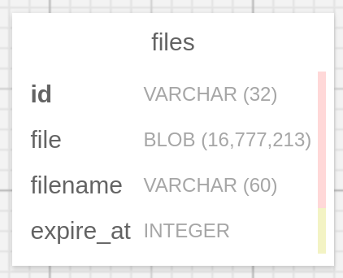

# FileSharing

### Max file size that can be hosted is 64 kb

## Database schema

## Service features
### Main page

- You can add file to form which will be sent file to db
- File and expiration time are required, otherwise you will see validation message
- After form submitting you will get id which you can use to get file
or you can download file via given link
### Get file page

- You can get file by id, file download should start automatically

### Check file page

- You can check file expiration time by file id

Service checks all files by expiration time every 24 hours, if
so it deletes them

Service checks file before you get or check it by expiration time, if
so it deletes it

If file is not present in db or id is incorrect service throws 404
